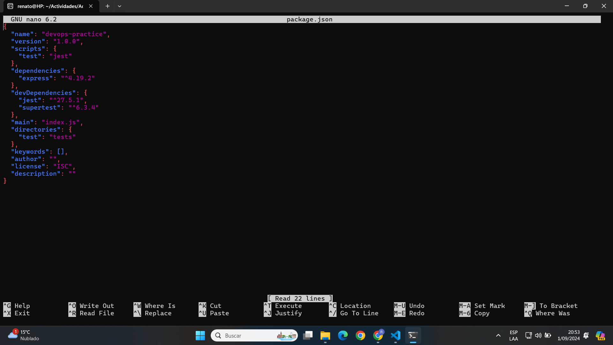
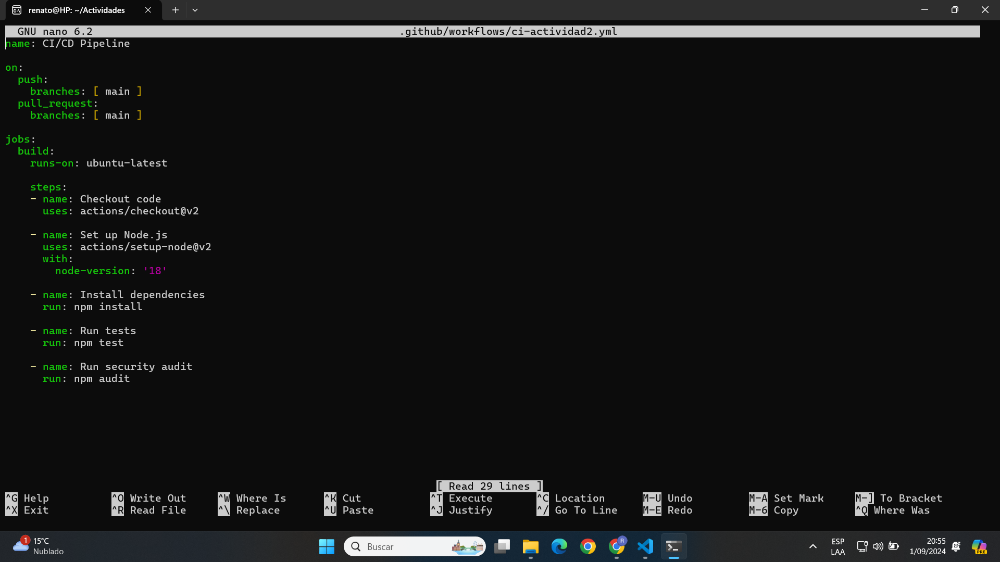
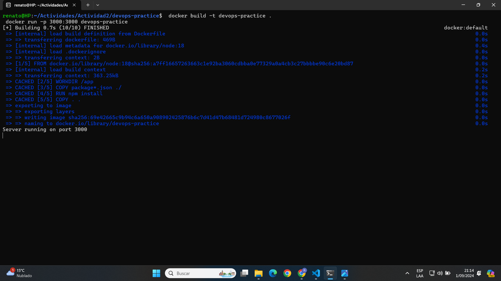
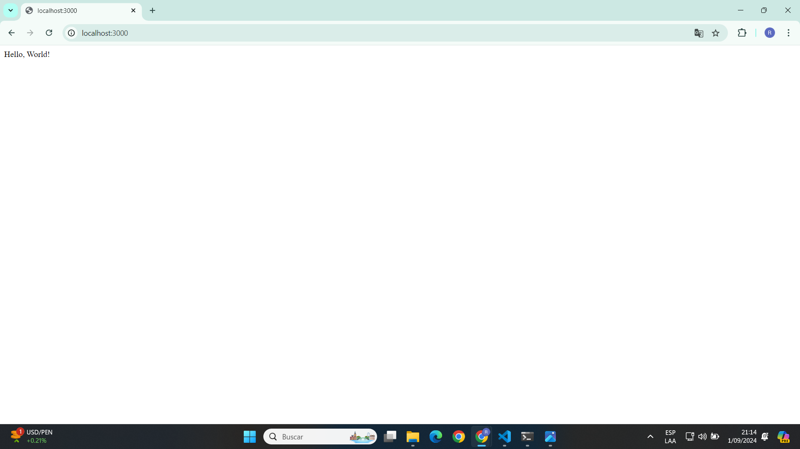
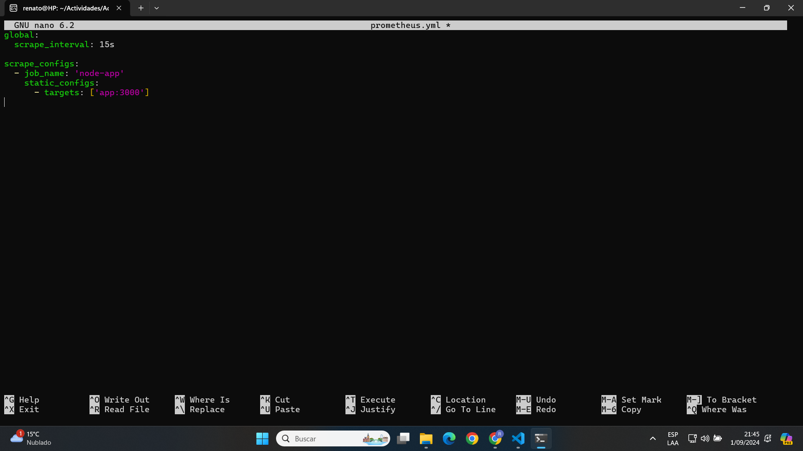
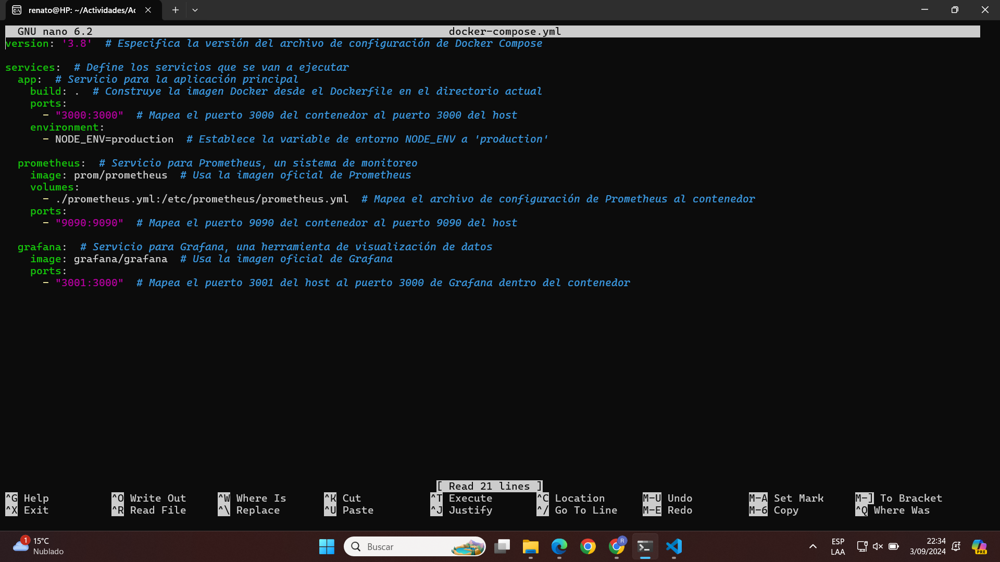

# Documentación de la Actividad 2
Una vez organizado los documentos y teniendo una estructura organizada, se creó la carpeta "Actividad2" en la cual contendrá "devops-practice"


## Creamos nuestro archivo: app.js


## Creamos nuestro app.test.js


## Configuramos nuestro package.json




## Integramos seguridad con la herramienta de análisis de seguridad estática: npm audit

### Código:
npm audit

## Actualizamos el archivo .github/workflows/ci-actividad2.yml




## Creamos el Dockerfile


## Construimos y corremos el contenedor



### Resultado




## Automatiza la gestión de contenedores usando Docker Compose

### Creamos el docker-compose.yml


## Corremos la aplicación usando Docker Compose


### Resultado


## Configuración de Prometheus y Grafana para monitorear la aplicación:

### Creamos el archivo prometheus.yml



## Configuramos Grafana utilizando un docker-compose.yml actualizado


## Corremos la aplicación


## Se tuvo un problema ya que Grafana no podía verse


## Se hace un cambio en el docker-compose


## Resultado de la aplicación


## Resultado de prometheus


## Resultado de grafana


## Al final se unió en un solo archivo ci.yml, en el cual para la actividad2 se puso en comentarios


## Aplicamos los siguientes comandos uno para que construya la imágen y otro para el test
- **`docker compose --build -d`**: Construye las imágenes de los servicios definidos en el archivo **`docker-compose.yml`** y las ejecuta en segundo plano.
- **`docker exec devops-practice-app-1 npm test`**: Ejecuta el comando **`npm test`** en el contenedor con nombre **`devops-practice-app-1`**.


# Implementación de observabilidad y aclaración
## Configuración del Pipeline de CI/CD

Para integrar pruebas de seguridad automatizadas en nuestro pipeline, utilizamos GitHub Actions y `npm audit`, una herramienta que revisa las dependencias de un proyecto Node.js en busca de vulnerabilidades conocidas.

### Pasos para la configuración:
1. **Crear un archivo de workflow en GitHub Actions:**
   - Ubicación: `.github/workflows/ci.yml`
   - Contenido:
     ```yaml
     name: Node.js CI con pruebas de seguridad

     on:
       push:
         branches: [ main ]
       pull_request:
         branches: [ main ]

     jobs:
       build:
         runs-on: ubuntu-latest

         steps:
         - uses: actions/checkout@v2
         - name: Set up Node.js
           uses: actions/setup-node@v2
           with:
             node-version: '14'
         - name: Install dependencies
           run: npm install
         - name: Run tests
           run: npm test
         - name: Perform security audit
           run: npm audit
     ```
   - Este workflow instala las dependencias, ejecuta pruebas y realiza un análisis de seguridad de las dependencias.

2. **Introducir una vulnerabilidad intencionada:**
   - Modificar el archivo `package.json` para incluir una versión obsoleta de una librería conocida por tener vulnerabilidades, como `lodash@4.17.15`.
   - Ejecutar el pipeline para observar cómo `npm audit` detecta y reporta la vulnerabilidad.

## Implementación de Observabilidad
Hemos hablado de observabilidad en la anterior actividad y sabemos que es esencial en el campo de desarrollo ya que permite a los equipos entender el estado interno de sus sistemas a partir de los datos externos que estos generan. En este caso usamos las siguientes herramientas:

### Herramientas Utilizadas
-Prometheus: Utilizado para recoger métricas del sistema y de la aplicación en tiempo real. Las métricas son almacenadas como series temporales, accesibles mediante consultas para análisis o alertas.

-Grafana: Empleado para visualizar las métricas recopiladas por Prometheus. Ofrece dashboards configurables que permiten ver el estado y rendimiento de la aplicación y la infraestructura de manera gráfica y en tiempo real.

## Reflexión sobre las Prácticas de DevOps
La integración de Docker y Docker Compose ha mejorado nuestros procesos de desarrollo y despliegue al mantener la consistencia mediante Infraestructura como Código (IaC), reduciendo la variabilidad y simplificando el control de versiones y las reversiones.

GitHub Actions en nuestra CI/CD y npm audit para escaneo de vulnerabilidades han incrementado significativamente la seguridad del desarrollo, asegurando que el nuevo código no introduzca fallos y mantenga la integridad en producción.

Prometheus y Grafana nos han brindado una visión detallada del rendimiento y la salud de las aplicaciones, permitiendo una detección y resolución proactiva de problemas, lo que reduce el tiempo de inactividad y mejora la experiencia del usuario.

En resumen, estas herramientas y prácticas refuerzan nuestro entorno DevOps al mejorar la automatización, seguridad y monitoreo, alineándose con los principios de DevSecOps para mitigar riesgos y reducir costos operativos.


# Ejercicios Adicionales - Parte Práctica

1. **Ejercicio 1**

