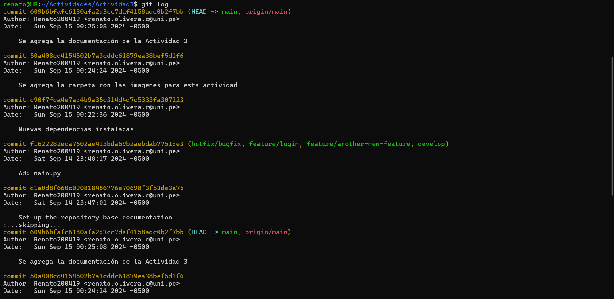
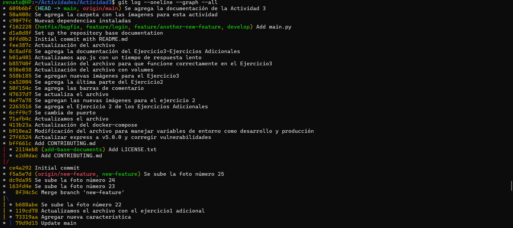
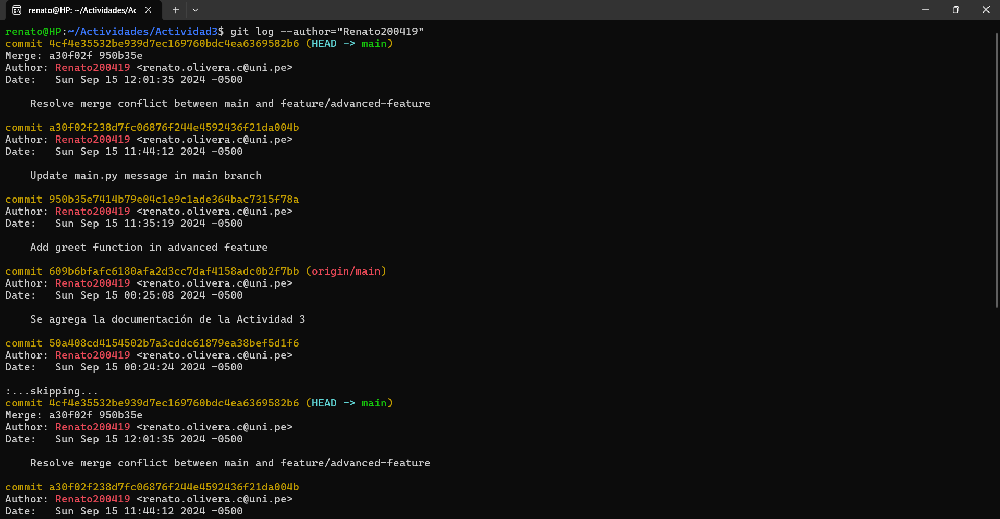
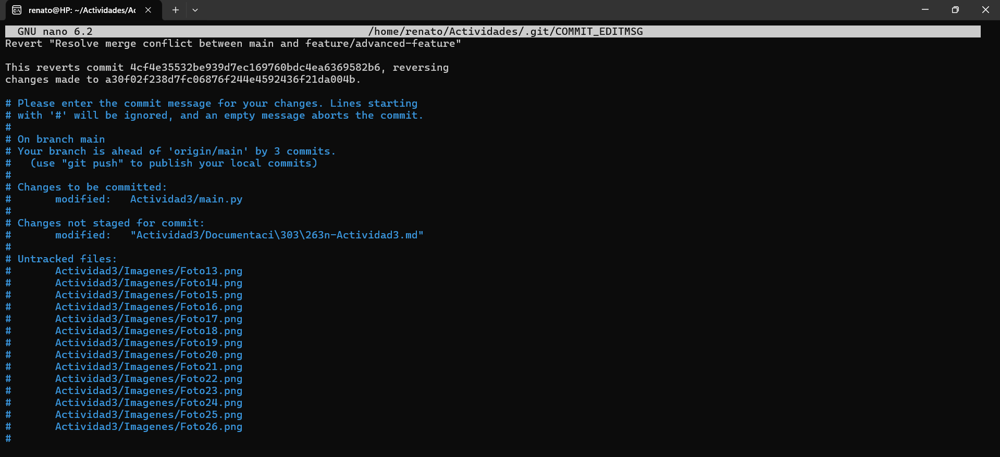
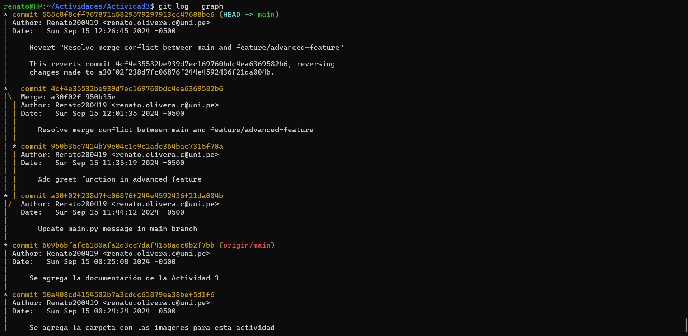

**Para esta Actividad se trabajará con un Índice para tener más orden y claridad**
# Índice
1. [Conceptos básicos de Git](#conceptos-básicos-de-git)
   1. [Git config: Preséntate a Git](#1-git-config-preséntate-a-git)
   2. [git init: Donde comienza tu viaje de código](#2-git-init-donde-comienza-tu-viaje-de-código)
   3. [git add: Preparando tu código](#3-git-add-preparando-tu-código)
   4. [git commit: Registra cambios](#4-git-commit-registra-cambios)
   5. [git log: Recorrer el árbol de commits](#5-git-log-recorrer-el-árbol-de-commits)
   6. [git branch: Entendiendo los conceptos básicos de Git branch](#6-git-branch-entendiendo-los-conceptos-básicos-de-git-branch)
   7. [git checkout/git switch: Cambiar entre branches](#7-git-checkoutgit-switch-cambiar-entre-branches)
   8. [git merge: Fusionando branches y git branch -d: Eliminando una Branch](#8-git-merge-fusionando-branches-y-git-branch--d-eliminando-una-branch)
2. [Preguntas](#preguntas)
3. [Ejercicios](#ejercicios)
   1. [Ejercicio 1: Manejo avanzado de branches y resolución de conflictos](#ejercicio-1-manejo-avanzado-de-branches-y-resolución-de-conflictos)
   2. [Ejercicio 2: Exploración y manipulación del historial de commits](#ejercicio-2-exploración-y-manipulación-del-historial-de-commits)
   3. [Ejercicio 3: Creación y gestión de branches desde commits específicos](#ejercicio-3-creación-y-gestión-de-branches-desde-commits-específicos)
   4. [Ejercicio 4: Manipulación y restauración de commits con git reset y git restore](#ejercicio-4-manipulación-y-restauración-de-commits-con-git-reset-y-git-restore)
   5. [Ejercicio 5: Trabajo colaborativo y manejo de Pull Requests](#ejercicio-5-trabajo-colaborativo-y-manejo-de-pull-requests)
   6. [Ejercicio 6: Cherry-Picking y Git Stash](#ejercicio-6-cherry-picking-y-git-stash)
# Conceptos básicos de Git
Para esta Actividad que sería la número 3 se profundizará el uso de Git en la parte práctica.

## 1.git config: Preséntate a Git
Para presentarnos ante Git se ejecutan los siguientes comandos


## 2. git init: Donde comienza tu viaje de código
Se crea el directorio y además como ya inicializamos nuestro repositorio desde la Actividad1, por eso sale esos comentarios


## 3. git add: Preparando tu código 
Se hizo `git add README.md` para agregar al área de preparación de Git ya que al inicio Git no lo rastreaba


## 4. git commit: registra cambios

En esta parte es importante escribir buenos mensajes de commit ya que ayuda a entender el lector los cambios que se ha realizado.


## 5. git log: Recorrer el árbol de commits

Muestra una lista de commits realizados en un repositorio en orden cronológico inverso, es decir, el commit más reciente se muestra primero


### Pregunta: ¿ Cual es la salida de este comando?
En este repositorio que se tiene branches tiene la siguiente salida:


### Pregunta: Intentemos el comando git log en este ejercicio (puedes realizar otra cosa como colocar las cosas en español). Primero, actualiza el archivo README.md y crea un nuevo archivo CONTRIBUTING.md:


## 6. git branch: Entendiendo los conceptos básicos de Git branch


## 7. git checkout/git switch: Cambiar entre branches


### Ejemplos adicionales

Para estos ejemplos se hicieron los siguientes pasos como crear y cambiar ramas


## 8. git merge: Fusionando branches y git branch -d: Eliminando una Branch


---

# Preguntas

- **Pregunta 1: ¿Cómo te ha ayudado Git a mantener un historial claro y organizado de tus cambios?**
Me ha ayudado mucho en tener un historial claro y organizado al permitirme registrar cada modificación con un mensaje descriptivo. Esto ayuda a rastrear quién hizo qué cambios y por qué, lo cual es esencial para la colaboración y el mantenimiento a largo plazo del proyecto.

- **Pregunta 2: ¿Qué beneficios ves en el uso de branches para desarrollar nuevas características o corregir errores?**
El uso de ramas en el desarrollo de software permite trabajar en nuevas características o correcciones de errores de manera aislada, sin afectar el código principal o de producción. Esto facilita la colaboración entre equipos, mejora la gestión de versiones, permite realizar pruebas y revisiones de forma independiente antes de integrar cambios.

- **Pregunta 3: Realiza una revisión final del historial de commits para asegurarte de que todos los cambios se han registrado correctamente.**
Mostramos el historial del repositorio con el comando: `git log`



- **Pregunta 4: Revisa el uso de branches y merges para ver cómo Git maneja múltiples líneas de desarrollo.**
El uso de ***branches*** en Git me permite trabajar en múltiples características o correcciones de manera simultánea sin afectar la línea principal de desarrollo, conocida como main. Como por ejemplo se ven las ramas de: main, develop y etc.


Y aquí hay una captura de un merge


Para ver más a detalle el uso de branches y merges resolveremos los ejercicios a continuación y así responder de mejor manera la pregunta.
---

# Ejercicios
# Ejercicio 1: Manejo avanzado de branches y resolución de conflictos
## Objetivo: 
Practicar la creación, fusión y eliminación de ramas, así como la resolución de conflictos que puedan surgir durante la fusión.

## Instrucciones:
### 1. Crear una nueva rama para una característica:
 - Crea una nueva rama llamada feature/advanced-feature desde la rama main:

```bash
   $ git branch feature/advanced-feature
   $ git checkout feature/advanced-feature
```
 

2. Modificar archivos en la nueva rama:
 - Edita el archivo main.py para incluir una función adicional:

   ```python
   def greet():
   print('Hello from advanced feature')
   
   greet()
   ```
 

 - Añade y confirma estos cambios en la rama feature/advanced-feature:
 

3. Simular un desarrollo paralelo en la rama main:

 - Cambia de nuevo a la rama main:
```bash
$ git checkout main
```
 - Edita el archivo main.py de forma diferente (por ejemplo, cambia el mensaje del print original):
```python
print('Hello World - updated in main')
```

- Añade y confirma estos cambios en la rama main:
```bash
 $ git add main.py
 $ git commit -m "Update main.py message in main branch"
```
 

4. Intentar fusionar la rama `feature/advanced-feature en main`:
- Fusiona la rama `feature/advanced-feature` en `main`:

```bash
$ git merge feature/advanced-feature
```

 


5. Resolver el conflicto de fusión:
 - Git generará un conflicto en main.py. Abre el archivo y resuelve el conflicto manualmente, eligiendo cómo combinar las dos versiones.
 - Después de resolver el conflicto, añade el archivo resuelto y completa la fusión:

**Durante el conflicto en main.py**
 

**Solución al conflicto en main.py**
 


Luego se hace lo siguiente:

```bash
 $ git add main.py
 $ git commit -m "Resolve merge conflict between main and feature/advanced-feature"
```

 
6. Eliminar la rama fusionada:
 - Una vez que hayas fusionado con éxito y resuelto los conflictos, elimina la rama feature/advanced-feature:

```bash
$ git branch -d feature/advanced-feature
```
 

# Ejercicio 2: Exploración y manipulación del historial de commits

## Objetivo: Aprender a navegar y manipular el historial de commits usando comandos avanzados de Git.

## Instrucciones:
1. Ver el historial detallado de commits:
 - Usa el comando git log para explorar el historial de commits, pero esta vez con más detalle:

 

 - Examina las diferencias introducidas en cada commit. ¿Qué cambios fueron realizados en cada uno?
 El comando `git log -p`en Git proporciona una vista detallada del historial de commits junto con las diferencias o "diffs" asociadas a cada uno. Se podría una vista detallada de lo que se ve:

 * **Historial de commits**: git log -p muestra la lista de commits en el repositorio, incluyendo información básica como el hash del commit, el autor, la fecha y el mensaje del commit.

 * **Diferencias ("diffs")**: Para cada commit en el historial, -p añade un detalle crucial: las diferencias entre el estado del código antes y después del commit. Esto incluye:

   - ***Líneas añadidas***: Las líneas de código nuevas se muestran precedidas por un signo de suma (+).
   - ***Líneas eliminadas***: Las líneas eliminadas se muestran precedidas por un signo de resta (-).

2. Filtrar commits por autor:
 - Usa el siguiente comando para mostrar solo los commits realizados por un autor específico:

```bash
$ git log --author="TuNombre"
```

Ejemplo: 

 


3. Revertir un commit:
 - Imagina que el commit más reciente en main.py no debería haberse hecho. Usa git revert para revertir ese commit:

```bash
$ git revert HEAD
```

Para eso se especifica cuál padre de los *merges* se quiere mantener como base.
 

Se guarda y se cierra este archivo: `Ctrl+o` y luego `Enter`. Finalmente `Ctrl+x`
  

- Verifica que el commit de reversión ha sido añadido correctamente al historial.




4. Rebase interactivo:
- Realiza un rebase interactivo para combinar varios commits en uno solo. Esto es útil para limpiar el historial de commits antes de una fusión.
- Usa el siguiente comando para empezar el rebase interactivo:
```bash
$ git rebase -i HEAD~3
```
- En el editor que se abre, combina los últimos tres commits en uno solo utilizando la opción squash.


5. Visualización gráfica del historial:
 - Usa el siguiente comando para ver una representación gráfica del historial de commits:
 - Reflexiona sobre cómo el historial de tu proyecto se visualiza en este formato. ¿Qué información adicional puedes inferir?


