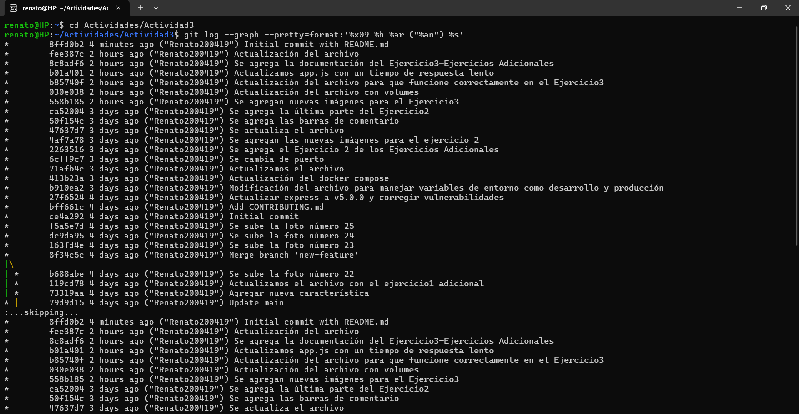

**Para esta Actividad se trabajará con un Índice para tener más orden y claridad**
   1. [Conceptos básicos de Git](#conceptos-básicos-de-git)
   1. [Git config: Preséntate a Git](#1-git-config-preséntate-a-git)
   2. [git init: Donde comienza tu viaje de código](#2-git-init-donde-comienza-tu-viaje-de-código)
   3. [git add: Preparando tu código](#3-git-add-preparando-tu-código)
   4. [git commit: Registra cambios](#4-git-commit-registra-cambios)
   5. [git log: Recorrer el árbol de commits](#5-git-log-recorrer-el-árbol-de-commits)
   6. [git branch: Entendiendo los conceptos básicos de Git branch](#6-git-branch-entendiendo-los-conceptos-básicos-de-git-branch)
   7. [git checkout/git switch: Cambiar entre branches](#7-git-checkoutgit-switch-cambiar-entre-branches)
   8. [git merge: Fusionando branches y git branch -d: Eliminando una Branch](#8-git-merge-fusionando-branches-y-git-branch--d-eliminando-una-branch)
# Conceptos básicos de Git
Para esta Actividad que sería la número 3 se profundizará el uso de Git en la parte práctica.

## 1.git config: Preséntate a Git
Para presentarnos ante Git se ejecutan los siguientes comandos

## 2. git init: Donde comienza tu viaje de código
Se crea el directorio y además como ya inicializamos nuestro repositorio desde la Actividad1, por eso sale esos comentarios

## 3. git add: Preparando tu código 
Se hizo `git add README.md` para agregar al área de preparación de Git ya que al inicio Git no lo rastreaba

## 4. git commit: registra cambios

En esta parte es importante escribir buenos mensajes de commit ya que ayuda a entender el lector los cambios que se ha realizado.

## 5. git log: Recorrer el árbol de commits

Muestra una lista de commits realizados en un repositorio en orden cronológico inverso, es decir, el commit más reciente se muestra primero

### Pregunta: ¿ Cual es la salida de este comando?
En este repositorio que se tiene branches tiene la siguiente salida:

### Pregunta: Intentemos el comando git log en este ejercicio (puedes realizar otra cosa como colocar las cosas en español). Primero, actualiza el archivo README.md y crea un nuevo archivo CONTRIBUTING.md:

## 6. git branch: Entendiendo los conceptos básicos de Git branch

## 7. git checkout/git switch: Cambiar entre branches

### Ejemplos adicionales

Para estos ejemplos se hicieron los siguientes pasos como crear y cambiar ramas

## 8. git merge: Fusionando branches y git branch -d: Eliminando una Branch

